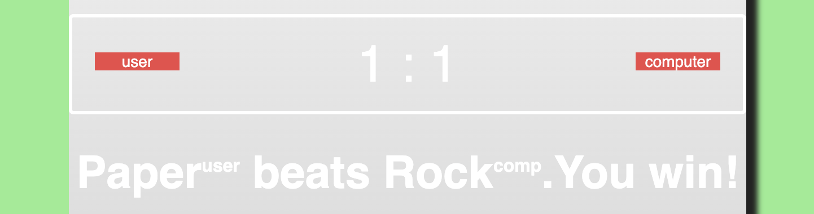
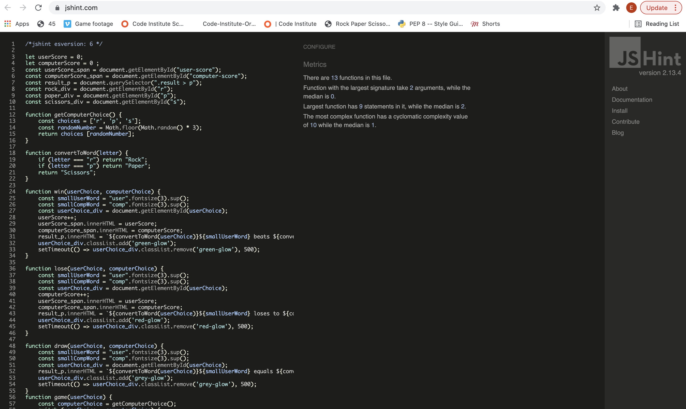

# Rock Paper Scissors Game

I created this website with a very simple idea, to pass time and have fun!
Since the Pandemic began, socially interacting with people has been a struggle.
Being indoors for most of the day, taking online classes and conversing over zoom is the new day-to-day.
During this time of staring on my screen I thought to myself "i need a break. I'd love to play a quick game", but not with 
the stress the accompanies firing up a playstation and loading a highly competitive game. Just looking for something easy, quick and fun!

I challenged myself to code an interactive online game. Not against other players, but against the greatest competitor the human race has ever had, The computer. I got to work and ended up with a neat little website that allows the user to play rock, paper, scissors against the computer. Simple but very thrilling. 

## Features

Upon entering the website you're greeted with a scoreboard "User vs Computer" with a 0 : 0 scoreboard to track the battle.

Below the scoreboard is the three options of attack, Rock, Paper or Scissors. The user can select the image to play their hand against the CPU.

After picking your point of attack, the scoreboard will return a result on the scoreboard and with a message like "Rock beats Scissors, You win!" or "Scissors beats paper, You lost!" The scoreboard will update the points scored and track the points throughout the battle.

## Existing Features

At the top of the page is Title of the game "Rock Paper Scissors" and below it sits
the User vs Computer scoreboard. 
Below the scoreboard is the text returning after each go. This text describes the result of the game after each turn.

## Testing

After getting my HTML, CSS and Javascript in order I made sure the website was functioning well. Some things I had to look out for is the functioning of the scoreboard. Originally it reset after each turn or once it reached a point. After fixing that, the text was off so some styling in CSS took care of that. I used google Chrome inspection tool to test out responsiveness and make changes to my wrapper, scoreboard and badges to adapt to smaller devices.

## Validator Testing
### HTML:

 I ran my HTML code through the official W3C validator and corrected my errors until it came back perfect. 

### CSS: 

 I took the same approach with my CSS code, except I ran that through the jigsaw w3 CSS validator.
  
  I made sure the project works on different screen sizes and browsers.

### JavaScript: 

No errors were found when passing through the official Jshint validator
The following metrics were returned:

Metrics
There are 13 functions in this file.

Function with the largest signature take 2 arguments, while the median is 0.

Largest function has 9 statements in it, while the median is 2.

The most complex function has a cyclomatic complexity value of 10 while the median is 1.

## Credits
 
 For this project i used code i was taught in lessons with The Coding Institute and CodeAcademy.
 I used the Love Running walkthrough project for help with my HTML and the Love Maths walkthrough for help with mostly javascript and CSS.
 I used a website called w3schools.com for help with my Game Components, like my functions. I found this website very useful.
 I got my media queries from css-tricks.com which helped me a lot.

## Deployment 

The site was deployed to GitHub pages. The steps to deploy are as follows:
In the GitHub repository, navigate to the Settings tab
From the source section drop-down menu, select the Master Branch
Once the master branch has been selected, the page will be automatically refreshed with a detailed ribbon display to indicate the successful deployment.

## Content & Media
 
The Images used for the Rock, Paper and Scissors were taken from an open source image site called Shutterstock.com.

